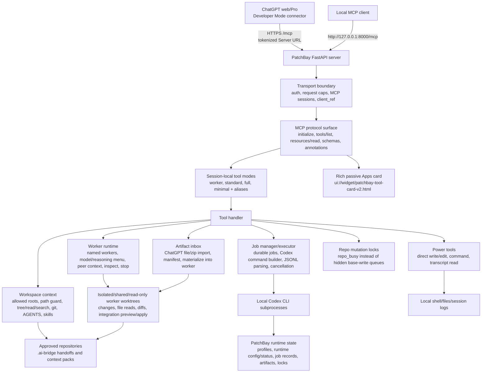

<h1 align="center">PatchBay</h1>

<p align="center">
  <strong>Route ChatGPT's context into local Codex workers.</strong>
</p>

<p align="center">
  
  
  
  
  
</p>

PatchBay is a local MCP control plane that routes ChatGPT's active conversation, project context, generated files, and long-running reasoning into your local Codex CLI. It lets ChatGPT open approved repositories, brief durable Codex workers by name, pass reports between them, inspect diffs, and apply accepted work from the chat instead of copy-pasting prompts, files, diffs, and status notes between ChatGPT and terminal Codex.

Use it when the best context already lives in ChatGPT web/Pro, Projects, memory, or another conversation, but the real work needs your local repository, local Codex setup, git state, tools, and execution environment.

| What PatchBay makes possible | Why it matters |
| --- | --- |
| ChatGPT context becomes executable | Reuse a deep ChatGPT conversation, project instructions, memory, and generated files as source material for local Codex work. |
| No copy-paste bridge | Move briefs, artifacts, reports, diffs, and follow-up instructions through MCP instead of manually shuttling text between apps. |
| Durable local worker loops | Start named Codex workers, continue them after restart, pass context between workers, and inspect their reports or diffs from ChatGPT. |
| Reverse Pro escalation loop | Package a local blocked problem for ChatGPT Pro, store the answer durably, then explicitly dispatch it to an idle origin worker or a new isolated worker. |
| Local execution stays local | Codex still runs on your machine against your repo, git state, toolchain, and configured Codex account. |
| Explicit power boundary | Isolated worktrees, tool modes, tokens, metadata, and integration previews keep powerful actions visible and reviewable. |

## Contents

- [Current Readiness](#current-readiness)
- [Capabilities](#capabilities)
- [Architecture](#architecture)
- [Quick Start](#quick-start)
- [Configuration](#configuration)
- [Public MCP Tool Tiers](#public-mcp-tool-tiers)
- [Power Boundary And Controls](#power-boundary-and-controls)
- [Development And Verification](#development-and-verification)

## Current Readiness

This branch is **pre-release verified**, not public-release complete.

| Area | Status |
| --- | --- |
| Codex CLI baseline | Current local verification recorded `codex-cli 0.142.2` |
| Python checks | `compileall` passes |
| Test suite | `281` tests pass |
| Live local MCP probe | `scripts/live_mcp_eval.py --json` passes against a disposable repo |
| Pro Escalation request loop | Unit tests and the live MCP probe cover CLI create, MCP list/read/claim/respond, CLI response readback, and blocked origin-worker dispatch |
| Named worker continuity eval | `scripts/worker_phase1_eval.py --timeout 600` passes real Codex start/restart/continue |
| Isolated writing worker eval | `scripts/worker_phase2_eval.py --timeout 900` passes real Codex isolated write/restart/continue/diff/cleanup |
| Multi-worker coordination eval | `scripts/worker_phase3_eval.py --timeout 900` passes real Codex peer diff/report relay |
| Worker integration eval | `scripts/worker_phase4_eval.py --timeout 900` passes real Codex integration preview/apply |
| Real MCP worker negative-case trial | `scripts/real_mcp_worker_trial.py --include-safety-cases` passes direct MCP worker lifecycle and negative cases |
| Direct multi-client MCP trial | `scripts/real_mcp_worker_trial.py --multi-client --tool-mode worker` passes two-session tool-mode, ownership, takeover, preview, and integration checks |
| Public tunnel MCP probe | Earlier tokenized ngrok MCP simulator passed health, `initialize`, worker-mode `tools/list`, artifact inbox import/list/inspect, isolated worker artifact attachment/read, integration exclusion, and cleanup; current run blocked only because no validation ngrok hostname was provided |
| Real Codex through MCP | `codex_plan_job` completes through PatchBay |
| Current Codex JSONL parsing | `agent_message` results parse into structured output |
| Real ChatGPT Developer Mode | Pending; latest local validation lacked browser automation for URL entry and trace capture |
| Real apply-job diff eval from ChatGPT | Pending |
| Real resume/continuation eval from ChatGPT | Pending |

## Capabilities

| Capability | Included |
| --- | --- |
| Streamable HTTP MCP endpoint | `/mcp` |
| Stdio MCP transport | `patchbay stdio` or `patchbay-stdio` for local MCP hosts |
| ChatGPT-ready descriptors | tool annotations, `_meta`, security schemes, invocation labels |
| Apps-style result card | rich passive `text/html;profile=mcp-app` resource for workers, artifacts, jobs, diffs, and power tools |
| Workspace context | tree, read, search, git status/diff, AGENTS, skills, context packs |
| Codex orchestration | plan, apply, status, result, diff, cancel, review, interactive, resume |
| Durable worker facade | discover worker model/reasoning options, import generated artifact context, start/message/list/inspect/stop named Codex colleagues, use isolated writing worktrees by default, and include bounded peer-worker context |
| Pro Escalation requests | create local-to-ChatGPT blocked-problem requests, read/claim/respond through MCP, and explicitly dispatch stored answers to workers |
| Repository boundary | allowed roots, path guard, blocked globs, worktree apply jobs |
| Handoff | `.ai-bridge` plan/status/diff and local execute/watch scripts |
| Power modes | direct write, exact edit, safe/full bash, bounded transcript reads |
| Connector UX | installable `patchbay` CLI, doctor, setup, start, settings, stdio, guided setup output, profiles, redacted runtime metadata, token-gated tunnels |

## Architecture



The core runtime is Python/FastAPI. ChatGPT sees the MCP surface; PatchBay keeps local paths, raw session ids, worker worktree paths, process logs, and runtime files behind the local control boundary unless a specific public tool is designed to expose a bounded summary.

## Requirements

- Python 3.10+
- Git
- `codex` CLI on `PATH`
- Codex CLI login or API key configured for the local Codex CLI

Recommended Codex CLI baseline for the current branch:

```bash
codex --version
# codex-cli 0.142.2
```

Install dependencies:

```bash
python3 -m venv .venv
source .venv/bin/activate
pip install -r requirements.txt
pip install -e ".[test]"  # needed for local test runs
```

`requirements.txt` holds the minimal runtime dependency set.
`pyproject.toml` holds package metadata, console entry points (`patchbay` and
`patchbay-stdio`), and the `test` extra used by CI and local verification.

## Quick Start

Start with a disposable git repo, not a private production checkout:

```bash
tmpdir=$(mktemp -d)
mkdir -p "$tmpdir/repo"
cd "$tmpdir/repo"
git init
printf '# Disposable Eval\n' > README.md
git add README.md
git -c user.name='Eval User' -c user.email='eval@example.invalid' commit -m init
```

Check connector readiness without opening a public tunnel:

```bash
patchbay doctor
patchbay start --root "$tmpdir/repo" --tool-mode worker --print-only
patchbay start --root "$tmpdir/repo" --tool-mode worker --print-only --json
```

`patchbay start --print-only` prints a ChatGPT setup guide with the Server URL,
authentication choice, tool mode, tunnel mode, exact ChatGPT Developer Mode
steps, useful restart/profile commands, and token/tunnel warnings. The JSON
form returns the same data under `setup_guide`, so local wrappers can display
the connector steps without scraping terminal text. `python scripts/start.py`
and `python scripts/doctor.py` remain compatibility wrappers.

For local MCP clients, start the local MCP server:

```bash
patchbay start --root "$tmpdir/repo" --tool-mode worker --save-profile
```

The local endpoint is:

```text
http://127.0.0.1:8000/mcp
```

For local MCP hosts that prefer stdio instead of HTTP:

```bash
patchbay stdio --config config.yaml
# or, after package installation:
patchbay-stdio --config config.yaml
```

For ChatGPT web, start PatchBay with an HTTPS tunnel and worker-first tool surface. Tunnel startup fails closed without a token:

```bash
export PATCHBAY_HTTP_TOKEN='<long-random-token>'
patchbay start \
  --root "$tmpdir/repo" \
  --tunnel-mode cloudflare \
  --tool-mode worker \
  --save-profile \
  --reveal-token
```

Copy the full tokenized Server URL printed by `--reveal-token`. It should look like `https://.../mcp?patchbay_token=...`. Tokenized ChatGPT Server URLs are redacted unless you ask to reveal them. To install Cloudflare Tunnel into PatchBay's local bin directory, run `patchbay install-cloudflared` explicitly. PatchBay also exposes tunnel shortcuts:

```bash
patchbay ngrok --root "$tmpdir/repo" --hostname your-domain.ngrok-free.dev --tool-mode worker --reveal-token
patchbay stable --root "$tmpdir/repo" --hostname patchbay.example.com --tunnel-name patchbay --tool-mode worker --reveal-token
```

OpenAI's Apps SDK docs describe the same connector shape: enable Developer Mode, create a connector, paste an HTTPS `/mcp` URL, then open a new chat and add the connector from the `+` / More menu. See [OpenAI Apps SDK quickstart](https://developers.openai.com/apps-sdk/quickstart#add-your-app-to-chatgpt) and [Connect from ChatGPT](https://developers.openai.com/apps-sdk/deploy/connect-chatgpt#create-a-connector).

Use `--tool-mode worker` for the first ChatGPT validation run; it exposes the worker tools plus the read-only context tools needed to brief them, while hiding low-level job/session controls and aliases. Direct tokenized public-tunnel MCP simulation has passed through ngrok, including artifact inbox transfer into an isolated worker. The real ChatGPT Developer Mode UI/tool-selection run remains a release gate.

One copied Server URL points to one shared local server. Multiple ChatGPT conversations or MCP clients connected to that URL can see the same local worker, job, artifact, and repository state. Start each conversation with `codex_self_test`; it returns a session-relative `client_ref`, active MCP session count, and shared-server coordination note without returning raw MCP session ids.

For multi-repository validation, include every repository at launch time. `--root` sets the default workspace and narrows `repositories.allowed` to that root unless extra roots are supplied:

```bash
patchbay start \
  --root "$repo_a" \
  --allow-root "$repo_b" \
  --tunnel-mode cloudflare \
  --tool-mode worker \
  --reveal-token
```

If a tool reports that a path is outside configured allowed roots, treat it as a launcher setup issue. Restart PatchBay with the missing repository passed through `--allow-root` or add it to `repositories.allowed`; do not work around the path guard.

ChatGPT can inspect mode choices with `codex_tool_mode_info` and request a session-local mode change with `codex_tool_mode_switch`. The switch does not rewrite config files. Direct MCP clients that call `tools/list` again on the same MCP session will see the new catalog; other sessions keep their own effective mode. ChatGPT Developer Mode may require refreshing the connector metadata before newly exposed tools appear.

Create the ChatGPT connector/app with:

```text
Settings -> Apps & Connectors -> Advanced settings
Developer mode: on
Enforce CSP in developer mode: on
Settings -> Connectors -> Create

Name: PatchBay
Description: Route ChatGPT context into local Codex workers
Connector URL / Server URL: paste the full HTTPS /mcp URL printed by patchbay start --reveal-token
Authentication: No Authentication / None
```

The ChatGPT app auth setting is `No Authentication / None` because the Server URL already includes the private PatchBay token. Do not configure OAuth or paste an API key into ChatGPT for this local bridge.

After ChatGPT shows the advertised tools, open a new chat, add PatchBay from the `+` / More menu, and start with:

```text
Use PatchBay. Act as engineering lead, not as the line-by-line coder. Call codex_self_test, then codex_open_workspace, then tell me what repo you can see and which worker tools are available.
```

See [QUICKSTART.md](QUICKSTART.md) for the full disposable-repo flow.

## Configuration

Edit `config.yaml` or use `patchbay start --root ...` to generate a private runtime config.

Important defaults:

```yaml
server:
  host: 127.0.0.1
  port: 8000
  max_concurrent_jobs: 10
  queue_enabled: true
  job_timeout_seconds: 0  # 0/none/unlimited disables Codex turn timeout
  stale_running_job_grace_seconds: 5
  max_request_bytes: 1048576
  enable_cors: false

app:
  tool_mode: full
  widget_domain: https://web-sandbox.oaiusercontent.com

auth:
  enabled: false
  token_env: PATCHBAY_HTTP_TOKEN
  allow_query_token: true
  require_for_non_loopback: true
  require_for_tunnel: true
  tunnel_mode: none

ownership:
  scope: token

repositories:
  default: /
  allowed:
    - /

security:
  require_git_repo: false
  "default_sandbox": danger-full-access
  allow_dangerously_bypass: true
  allowed_env_keys:
    - "*"

power_tools:
  direct_write: true
  bash_mode: "full"
  codex_session_read: true

logging:
  audit_file:
  job_logs_dir:
  job_state_dir:
  write_raw_job_logs: false
  access_log: false

workers:
  worktree_root: ""

pro_requests:
  root:
  mirror_enabled: true
  mirror_dir: ".ai-bridge/pro-requests"
  max_report_bytes: 200000
  max_response_bytes: 200000
  max_attachment_bytes: 2000000
  max_attachments_per_request: 10
```

Blank logging paths resolve outside the checkout under `PATCHBAY_HOME/runtime`
when `PATCHBAY_HOME` is set, otherwise under `~/.patchbay/runtime`.
Set explicit paths only when you deliberately want repo-local or custom runtime
state.

For local loopback use, auth can remain off. For non-loopback bind addresses, public URL mode, tunnel mode, or explicit `PATCHBAY_HTTP_TOKEN`, every MCP/status request must include a matching Bearer token or an allowed query token.

Prefer Bearer auth where the client supports headers:

```http
Authorization: Bearer <token>
```

Copied ChatGPT Server URLs can use query-token auth:

```text
https://your-tunnel.example/mcp?patchbay_token=<token>
```

Never commit or share a real tokenized URL.

## Public MCP Tool Tiers

The canonical public names are `codex_*`. In `full` tool mode, compatibility aliases such as `read`, `write`, `edit`, `bash`, `show_changes`, `git_status`, `git_diff`, `workspace_snapshot`, `export_pro_context`, and `handoff_to_agent` can also be advertised. Aliases resolve to the canonical handlers and now expose precise CodexPro-derived input schemas adapted to PatchBay argument names. Use `--tool-mode worker` for a worker-first surface that hides low-level job/session controls and compatibility aliases while keeping worker tools plus the context tools needed to brief them. In this mode, ChatGPT should act as a lead/consultant: use direct read/search tools for light orientation and verification, and delegate non-trivial repository investigation or implementation to named Codex workers through natural-language briefs. All modes expose `codex_tool_mode_info` and `codex_tool_mode_switch` so ChatGPT can compare surfaces and request temporary session-local broadening when the host refreshes the tool list.

### Natural-language workers

| Tool | Purpose | Read-only |
| --- | --- | --- |
| `codex_worker_options` | Return a bounded Codex model/reasoning menu for worker setup without exposing raw config/catalog data | yes |
| `codex_worker_inbox` | Import ChatGPT-generated files or zips into local artifact context, list/inspect them, or clean up local copies | no |
| `codex_worker_start` | Start a named Codex colleague with an English brief; defaults to an isolated writing worktree | no |
| `codex_worker_message` | Continue or redirect the same Codex conversation by worker name in the same workspace | no |
| `codex_worker_list` | List workers, current state, and latest report | yes |
| `codex_worker_inspect` | Read one worker's current state, report, changed files, worker-created file content, one-file diff, or integration preview | yes |
| `codex_worker_integrate` | Apply an explicitly accepted isolated worker result to the base checkout without committing or deleting the worktree | no |
| `codex_worker_stop` | Stop the active turn and optionally discard an isolated worker workspace | no |

Workers are derived from persisted job records and Codex sessions. Human worker names are scoped to the base workspace, so `Small Implementer` can exist in more than one repo; pass `repo_path` or use the public `worker_id` only when a name is ambiguous. ChatGPT should treat these workers as local assistants, not low-level commands: ask natural questions, assign goals and deliverables, and let workers find the relevant repository details unless exact paths matter. Workers are continuing specialists, not disposable one-shot summaries; if a report is thin, contradictory, missing evidence, missing validation, or important enough to drive a decision, ChatGPT should continue the same worker with `codex_worker_message` before final synthesis. For larger work, ChatGPT can start several workers with separate responsibilities and reconcile their reports using `context_from_workers`. Consequential audits and implementation tasks should ask workers for a durable report file or changed-file evidence in the worker workspace, then inspect that evidence before integration. When ChatGPT needs control over the underlying Codex model or reasoning depth, it should call `codex_worker_options` and then pass `model` and/or `reasoning_effort` to `codex_worker_start`. When ChatGPT has generated a plan, file, or zip that local Codex should use, it should call `codex_worker_inbox(action="import_file")` and pass the returned artifact id through `context_from_artifacts`. Imports are local context only and can be repeated; they do not edit the repository. Follow-up `codex_worker_message` calls inherit the worker's prior model/reasoning choices unless explicitly overridden and can attach later imported artifacts.

Default writing workers use durable external worktrees with on-demand changed-file, file-content, and one-file diff inspection. Before integration, `codex_read_file` reads only the base checkout; use `codex_worker_inspect(view="file", file_path="...")` to read a worker-created file from its isolated worktree. Imported artifacts are copied into `.ai-bridge/imported-artifacts/` inside the isolated worker worktree and excluded from changes, diffs, integration previews, and applies. Worker start/message calls can include bounded report/change/diff context from other workers, and `codex_worker_list` returns a concise `team_report`.

If multiple ChatGPT conversations share one Server URL, worker and artifact views include owner-relative coordination flags. By default `ownership.scope: token` treats calls using the same bearer/query token as the same coordination owner, so short-lived transport sessions from the same copied connector URL can continue the same workers without takeover. Read/list/inspect remain shared, but mutating another owner's worker or artifact requires an explicit `takeover: true` call after user confirmation. When `queue_enabled: true`, Codex turns above `max_concurrent_jobs` remain pending until an execution slot opens. Base-checkout mutation paths, including direct writes, command execution, shared-write workers, and worker integration, still use per-repository mutation locks and return `repo_busy` instead of queueing hidden writes. PatchBay does not add a worker database, message bus, transcript copy, role engine, automatic reviewer chain, automatic commits, or automatic merge queue.

### Pro Escalation requests

| Tool | Purpose | Read-only |
| --- | --- | --- |
| `codex_pro_request_list` | List open or recent local-to-ChatGPT Pro requests | yes |
| `codex_pro_request_read` | Read one bounded report, response, attachment index, and repo staleness check | yes |
| `codex_pro_request_claim` | Claim the request for the current MCP connection | no |
| `codex_pro_request_respond` | Store ChatGPT Pro's answer only; no execution, dispatch, edit, apply, or commit | no |
| `codex_pro_request_dispatch` | Explicitly send the stored answer to an idle origin worker or start a new isolated worker | no |
| `codex_pro_request_close` | Close, cancel, or supersede a request | no |

Local creation and operator inspection use `patchbay pro-request create/list/show/response/dispatch/close`. The canonical store lives in PatchBay runtime storage; `.ai-bridge/pro-requests/<request-id>/` is a sanitized mirror for local visibility. Dispatch is deliberate and never integrates worker output into the base checkout. See [docs/pro-escalations/USER_FLOW.md](docs/pro-escalations/USER_FLOW.md) and [docs/pro-escalations/ARCHITECTURE.md](docs/pro-escalations/ARCHITECTURE.md).

### Core Codex jobs

| Tool | Purpose | Read-only |
| --- | --- | --- |
| `codex_plan_job` | Start a Codex analysis job using the configured sandbox | no in the full-power profile |
| `codex_apply_job` | Start an isolated Codex apply job in a git worktree | no |
| `codex_get_status` | Inspect async job state | yes |
| `codex_get_result` | Fetch completed job output | yes |
| `codex_get_diff` | Inspect a changed file diff from a completed apply job | yes |
| `codex_cancel_job` | Cancel a pending or running local Codex job | no |
| `codex_review` | Run Codex review on owned changes | yes |
| `codex_interactive` | Start an async Codex exec session job | no |
| `codex_interactive_reply` | Continue a Codex session through an async job | no |
| `codex_resume` | Resume a prior Codex session through an async job | no |
| `codex_list_sessions` | List bounded PatchBay-known and configured Codex-home session metadata without transcripts or source paths | yes |

### Workspace context

| Tool | Purpose | Read-only |
| --- | --- | --- |
| `codex_self_test` | Check connector readiness and Server URL metadata | yes |
| `codex_open_workspace` | Orient ChatGPT to an allowed workspace | yes |
| `codex_list_workspaces` | List configured workspaces | yes |
| `codex_workspace_snapshot` | Return git status, recent commits, `.ai-bridge`, and compact tree | yes |
| `codex_inventory` | Return tool modes, skills, git state, and power-mode settings | yes |
| `codex_repo_tree` | Return a bounded repository tree | yes |
| `codex_read_file` | Read a bounded text file slice | yes |
| `codex_search_repo` | Search the repo with bounded, redacted results | yes |
| `codex_git_status` | Show branch and changed files without bash | yes |
| `codex_git_diff` | Show bounded git diff without bash | yes |
| `codex_show_changes` | Return review-oriented status and optional diff, optionally scoped to one file | yes |
| `codex_load_context` | Load AGENTS, selected files, git, and `.ai-bridge` context | yes |
| `codex_list_skills` | List discovered skills with sanitized paths | yes |
| `codex_load_skill` | Load a bounded discovered `SKILL.md` | yes |

### Handoff and context artifacts

| Tool | Purpose | Read-only |
| --- | --- | --- |
| `codex_export_context` | Write selected context under `.ai-bridge` | no |
| `codex_write_handoff` | Write `.ai-bridge/current-plan.md` | no |
| `codex_get_handoff_status` | Read `.ai-bridge` status artifacts | yes |
| `codex_get_handoff_diff` | Read bounded handoff diff artifacts | yes |

Local handoff commands are available without attaching ChatGPT:

```bash
python scripts/handoff.py execute --root /path/to/repo --agent custom --command-template "my-agent --task-file {{plan_file}}" --yes
python scripts/handoff.py watch --root /path/to/repo --agent custom --command-template "my-agent --task-file {{plan_file}}" --once --yes
python scripts/pro_context.py bundle --root /path/to/repo --path README.md --include-diff
python scripts/pro_context.py apply --root /path/to/repo --file plan.md --agent codex
```

### Optional power tools

These are public capabilities and the current full-power profile enables them by default. Disable them in `config.yaml` or at launch when you want a narrower run:

| Tool | Required config |
| --- | --- |
| `codex_write_file` | `power_tools.direct_write: true` |
| `codex_edit_file` | `power_tools.direct_write: true` |
| `codex_run_command` | `power_tools.bash_mode: safe` or `full` |
| `codex_read_session` | `power_tools.codex_session_read: true` |

`tools/list` is runtime-aware for these capabilities: if a profile disables
direct write, bash, or session transcript reads, the corresponding canonical
tools and compatibility aliases are not advertised and calls to them are
rejected. The checked-in profile remains intentionally full-power and continues
to expose the full catalog.

## ChatGPT Metadata And Tool Card

`tools/list` includes ChatGPT/App metadata for every public tool: `title`, read/write/open-world annotations, top-level `securitySchemes`, `_meta.securitySchemes`, `_meta.ui.resourceUri`, `openai/outputTemplate`, `openai/fileParams` where a tool receives ChatGPT files, and short invocation labels.

The server exposes a rich passive Apps card resource:

```text
ui://widget/patchbay-tool-card-v2.html
```

Clients can fetch it with `resources/list` and `resources/read`. The MIME type is `text/html;profile=mcp-app`. The current card is derived from the copied CodexPro widget subsystem and renders bounded worker reports, artifact inbox summaries, job status, diffs, direct command/write results, integration previews, ownership/takeover states, and `repo_busy` lock states. It remains passive: it does not initiate tool calls. The legacy `ui://widget/patchbay-tool-card-v1.html` URI remains readable for compatibility, while descriptors advertise v2.

## Power Boundary And Controls

PatchBay is deliberately powerful. These controls are not the product story; they are the boundary that makes it practical to aim ChatGPT at real local engineering work without hiding what is reading, writing, executing, or applying.

- Keep first runs on disposable repos.
- The checked-in profile is intentionally full-power: `/` allowed root, `danger-full-access`, direct writes, full bash, and Codex session reads.
- For public or shared runs, narrow `repositories.allowed`, set `power_tools.bash_mode: "off"` or `"safe"`, and disable `allow_dangerously_bypass`.
- Keep CORS disabled unless a trusted local UI requires it.
- Do not expose public URLs without `PATCHBAY_HTTP_TOKEN`.
- Do not put secrets, credentials, customer data, or private logs in prompts or repos used for testing.
- With `blocked_globs: []`, workspace tools do not block secret-like paths by glob; symlink escapes, binary files, size caps, and output redaction still apply.
- `codex_get_diff` only returns diffs from completed apply jobs and files proven changed by git status/diff.
- Handoff writes are scoped to `.ai-bridge`.
- Direct writes, bash, and transcript reads are enabled in the checked-in full-power profile.
- Child Codex and bash processes inherit the full process environment when `allowed_env_keys: ["*"]`.
- Worker model/reasoning selection uses `codex debug models` or the local Codex model cache for bounded public metadata. It returns only model ids and concise option metadata, not raw Codex config paths, prompts, provider credentials, or auth data.
- Audit logs and job state do not store raw prompt bodies by default.
- Job stdout/stderr artifacts are redacted and capped unless `logging.write_raw_job_logs: true`.

## Development And Verification

Run the local baseline:

```bash
codex --version
PYTHONDONTWRITEBYTECODE=1 python -m compileall -q src scripts tests
PYTHONDONTWRITEBYTECODE=1 python -m pytest tests -q
PYTHONDONTWRITEBYTECODE=1 python scripts/live_mcp_eval.py --json
```

The live eval does not use ChatGPT and does not open a public tunnel. It starts the real launcher/server against a temporary repo and behaves like a compact MCP client. External-style coverage is tracked separately with a tokenized public-tunnel MCP simulator; the latest ngrok run passed the artifact inbox worker flow but still was not the real ChatGPT UI.

For shared-server coordination checks, run:

```bash
PYTHONDONTWRITEBYTECODE=1 python scripts/real_mcp_worker_trial.py --multi-client --tool-mode worker --json
```

That direct MCP trial uses two logical MCP sessions against a disposable repo. It verifies session-local tool modes, shared inspection, cross-owner mutation refusal, explicit takeover, ownership transfer, preview-before-integrate, no automatic commit, and sanitized private evidence under `.local/validation/`.

## Documentation Map

- [docs/README.md](docs/README.md): full documentation index.
- [QUICKSTART.md](QUICKSTART.md): disposable first-run flow.
- [docs/user/chatgpt-instructions.md](docs/user/chatgpt-instructions.md): tool-use guidance for ChatGPT or another MCP client.
- [docs/architecture/overview.md](docs/architecture/overview.md): current hybrid architecture.
- [docs/reference/public-tool-surface.md](docs/reference/public-tool-surface.md): tool tiers, schemas, aliases, and metadata policy.
- [docs/worker-bridge/README.md](docs/worker-bridge/README.md): natural-language worker bridge architecture and implementation history.
- [docs/pro-escalations/ARCHITECTURE.md](docs/pro-escalations/ARCHITECTURE.md): reverse local-to-ChatGPT Pro request architecture.
- [docs/pro-escalations/USER_FLOW.md](docs/pro-escalations/USER_FLOW.md): operator and ChatGPT flow for Pro Requests.
- [docs/reference/context-and-handoff.md](docs/reference/context-and-handoff.md): AGENTS, skills, context packs, and `.ai-bridge`.
- [docs/project/why-patchbay.md](docs/project/why-patchbay.md): product purpose and value proposition.
- [SECURITY.md](SECURITY.md): vulnerability reporting and operator warnings.
- [docs/security/product-boundary.md](docs/security/product-boundary.md): power-control model.
- [TESTING.md](TESTING.md): local checks and live MCP evals.
- [docs/testing/evals.md](docs/testing/evals.md): release eval matrix.
- [NOTICE](NOTICE): CodexPro attribution.

## Credits

PatchBay includes behavior, documentation, tests, and implementation patterns derived from or inspired by open-source CodexPro work. See [NOTICE](NOTICE) for attribution and license details.

## License

MIT
