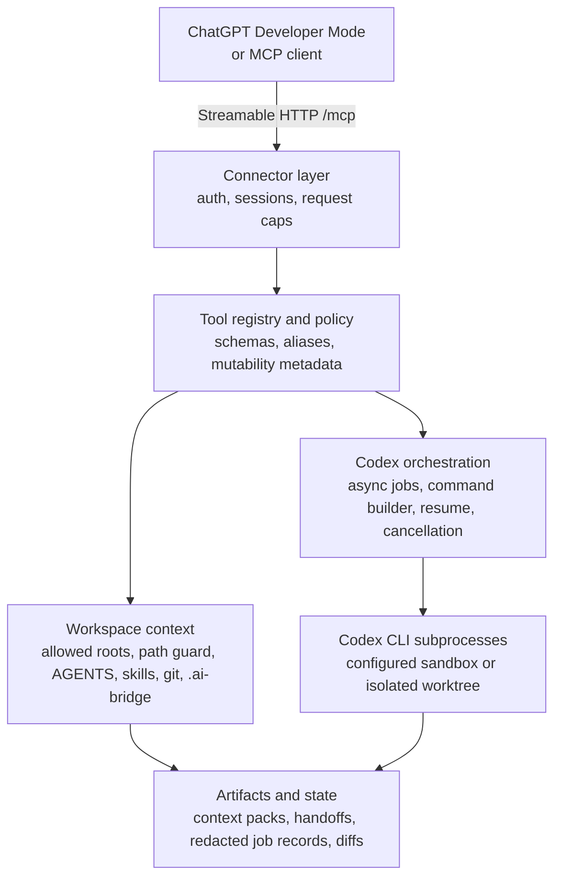

<h1 align="center">Codex MCP Wrapper</h1>

<p align="center">
  <strong>Connect ChatGPT web/Pro to local repositories and local Codex CLI.</strong>
</p>

<p align="center">
  
  
  
  
  
</p>

`codex-mcp-wrapper` is a pre-release ChatGPT-to-local-Codex bridge. It exposes a local Streamable HTTP MCP server so ChatGPT or another MCP-compatible client can inspect allowed local workspaces, use bounded repository tools, and delegate larger tasks to the local Codex CLI.

It combines three complementary workflows:

| Mode | What ChatGPT can do |
| --- | --- |
| Direct workspace coder | Open an allowed workspace, read/search files, load AGENTS and skills, inspect git state, write `.ai-bridge` handoffs, and optionally use direct edit or command power tools. |
| Named Codex colleagues | Start persistent workers with natural-language briefs, let writing workers use isolated worktrees by default, pass bounded report/change/diff context between workers, inspect reports/changes, restart the wrapper, and continue conversations by human name. |
| Local Codex controller | Start real local `codex exec` jobs, poll status, retrieve structured results, inspect worktree diffs, and continue/resume Codex sessions when available. |

This repository remains the release target. CodexPro is MIT-licensed source material and product inspiration, not the upstream project for this wrapper. See [NOTICE](NOTICE) for attribution and thanks.

## Contents

- [Current Readiness](#current-readiness)
- [Capabilities](#capabilities)
- [Architecture](#architecture)
- [Quick Start](#quick-start)
- [Configuration](#configuration)
- [Public MCP Tool Tiers](#public-mcp-tool-tiers)
- [Safety And Power Controls](#safety-and-power-controls)
- [Development And Verification](#development-and-verification)

## Current Readiness

This branch is **pre-release verified**, not public-release complete.

| Area | Status |
| --- | --- |
| Codex CLI baseline | Verified with `codex-cli 0.142.2` |
| Python checks | `compileall` passes |
| Test suite | `196` tests pass |
| Live local MCP probe | `scripts/live_mcp_eval.py --json` passes against a disposable repo |
| Named worker continuity eval | `scripts/worker_phase1_eval.py --timeout 600` passes real Codex start/restart/continue |
| Isolated writing worker eval | `scripts/worker_phase2_eval.py --timeout 900` passes real Codex isolated write/restart/continue/diff/cleanup |
| Multi-worker coordination eval | `scripts/worker_phase3_eval.py --timeout 900` passes real Codex peer diff/report relay |
| Worker integration eval | `scripts/worker_phase4_eval.py --timeout 900` passes real Codex integration preview/apply |
| Real MCP worker safety trial | `scripts/real_mcp_worker_trial.py --include-safety-cases` passes direct MCP worker lifecycle and negative cases |
| Public tunnel MCP probe | Tokenized ngrok probe passed health, `initialize`, and worker-mode `tools/list` |
| Real Codex through MCP | `codex_plan_job` completes through the wrapper |
| Current Codex JSONL parsing | `agent_message` results parse into structured output |
| Real ChatGPT Developer Mode | Pending; latest local validation lacked browser automation for URL entry and trace capture |
| Real apply-job diff eval from ChatGPT | Pending |
| Real resume/continuation eval from ChatGPT | Pending |

## Capabilities

| Capability | Included |
| --- | --- |
| Streamable HTTP MCP endpoint | `/mcp` |
| ChatGPT-ready descriptors | tool annotations, `_meta`, security schemes, invocation labels |
| Apps-style result card | passive `text/html;profile=mcp-app` resource |
| Workspace context | tree, read, search, git status/diff, AGENTS, skills, context packs |
| Codex orchestration | plan, apply, status, result, diff, cancel, review, interactive, resume |
| Durable worker facade | discover worker model/reasoning options, start/message/list/inspect/stop named Codex colleagues, use isolated writing worktrees by default, and include bounded peer-worker context |
| Isolation | allowed roots, path guard, blocked globs, worktree apply jobs |
| Handoff | `.ai-bridge` plan/status/diff and local execute/watch scripts |
| Power modes | direct write, exact edit, safe/full bash, bounded transcript reads |
| Connector UX | doctor, start, profiles, redacted runtime metadata, token-gated tunnels |

## Architecture



The core runtime is Python/FastAPI. CodexPro behavior has been ported or adapted into the wrapper rather than kept as a permanent TypeScript sidecar.

## Requirements

- Python 3.10+
- Git
- `codex` CLI on `PATH`
- Codex CLI login or API key configured for the local Codex CLI

Recommended Codex CLI baseline for the current branch:

```bash
codex --version
# codex-cli 0.142.2
```

Install dependencies:

```bash
python3 -m venv .venv
source .venv/bin/activate
pip install -r requirements.txt
```

## Quick Start

Start with a disposable git repo, not a private production checkout:

```bash
tmpdir=$(mktemp -d)
mkdir -p "$tmpdir/repo"
cd "$tmpdir/repo"
git init
printf '# Disposable Eval\n' > README.md
git add README.md
git -c user.name='Eval User' -c user.email='eval@example.invalid' commit -m init
```

Check connector readiness without opening a public tunnel:

```bash
python scripts/doctor.py
python scripts/start.py --root "$tmpdir/repo" --print-only
```

Start the local MCP server:

```bash
python scripts/start.py --root "$tmpdir/repo" --save-profile
```

The local endpoint is:

```text
http://127.0.0.1:8000/mcp
```

For ChatGPT web through a public tunnel, set a token first. Tunnel startup fails closed without it:

```bash
export CODEX_MCP_HTTP_TOKEN='<long-random-token>'
python scripts/start.py \
  --root "$tmpdir/repo" \
  --tunnel-mode cloudflare \
  --tool-mode worker \
  --save-profile
```

The launcher does not install `cloudflared` or `ngrok`; install and verify your tunnel provider separately. Tokenized ChatGPT Server URLs are redacted by default and shown only with `--reveal-token`. Use `--tool-mode worker` for the first ChatGPT validation run; it exposes the worker tools plus the read-only context tools needed to brief them, while hiding low-level job/session controls and aliases. Direct tokenized public-tunnel MCP probing has passed through ngrok, but the real ChatGPT Developer Mode UI/tool-selection run remains a release gate.

ChatGPT can inspect mode choices with `codex_tool_mode_info` and request a process-local mode change with `codex_tool_mode_switch`. The switch does not rewrite config files. Direct MCP clients that call `tools/list` again will see the new catalog; ChatGPT Developer Mode may require refreshing the connector metadata before newly exposed tools appear.

Create the ChatGPT app with:

```text
Settings -> Apps -> Advanced settings
Developer mode: on
Enforce CSP in developer mode: on
Create app

Name: Codex MCP Wrapper
Description: Local workspace and Codex bridge for ChatGPT coding
Connection: Server URL
Server URL: paste the full URL printed by scripts/start.py --reveal-token
Authentication: No Authentication / None
```

The ChatGPT app auth setting is `No Authentication / None` because the Server URL already includes the private wrapper token. Do not configure OAuth or paste an API key into ChatGPT for this local bridge.

See [QUICKSTART.md](QUICKSTART.md) for the full disposable-repo flow.

## Configuration

Edit `config.yaml` or use `scripts/start.py --root ...` to generate a private runtime config.

Important defaults:

```yaml
server:
  host: 127.0.0.1
  port: 8000
  max_concurrent_jobs: 1
  job_timeout_seconds: 1800
  stale_running_job_grace_seconds: 5
  max_request_bytes: 1048576
  enable_cors: false

app:
  tool_mode: full
  widget_domain: https://web-sandbox.oaiusercontent.com

auth:
  enabled: false
  token_env: CODEX_MCP_HTTP_TOKEN
  allow_query_token: true
  require_for_non_loopback: true
  require_for_tunnel: true
  tunnel_mode: none

repositories:
  default: /
  allowed:
    - /

security:
  require_git_repo: false
  "default_sandbox": danger-full-access
  allow_dangerously_bypass: true
  allowed_env_keys:
    - "*"

power_tools:
  direct_write: true
  bash_mode: "full"
  codex_session_read: true

logging:
  job_logs_dir: ./logs/jobs
  job_state_dir: ./logs/jobs/state
  write_raw_job_logs: false
  access_log: false

workers:
  worktree_root: ""
```

For local loopback use, auth can remain off. For non-loopback bind addresses, public URL mode, tunnel mode, or explicit `CODEX_MCP_HTTP_TOKEN`, every MCP/status request must include a matching Bearer token or an allowed query token.

Prefer Bearer auth where the client supports headers:

```http
Authorization: Bearer <token>
```

Copied ChatGPT Server URLs can use query-token auth:

```text
https://your-tunnel.example/mcp?codex_mcp_token=<token>
```

Never commit or share a real tokenized URL.

## Public MCP Tool Tiers

The canonical public names are `codex_*`. In `full` tool mode, CodexPro-compatible aliases such as `read`, `write`, `edit`, `bash`, `show_changes`, `git_status`, `git_diff`, `workspace_snapshot`, `export_pro_context`, and `handoff_to_agent` can also be advertised. Aliases resolve to the canonical handlers. Use `--tool-mode worker` for a worker-first surface that hides low-level job/session controls and compatibility aliases while keeping worker tools plus the context tools needed to brief them. All modes expose `codex_tool_mode_info` and `codex_tool_mode_switch` so ChatGPT can compare surfaces and request temporary broadening when the host refreshes the tool list.

### Natural-language workers

| Tool | Purpose | Read-only |
| --- | --- | --- |
| `codex_worker_options` | Return a bounded Codex model/reasoning menu for worker setup without exposing raw config/catalog data | yes |
| `codex_worker_start` | Start a named Codex colleague with an English brief; defaults to an isolated writing worktree | no |
| `codex_worker_message` | Continue or redirect the same Codex conversation by worker name in the same workspace | no |
| `codex_worker_list` | List workers, current state, and latest report | yes |
| `codex_worker_inspect` | Read one worker's current state, report, changed files, worker-created file content, one-file diff, or integration preview | yes |
| `codex_worker_integrate` | Apply an explicitly accepted isolated worker result to the base checkout without committing or deleting the worktree | no |
| `codex_worker_stop` | Stop the active turn and optionally discard an isolated worker workspace | no |

Workers are derived from existing persisted job records and Codex sessions. Human worker names are scoped to the base workspace, so `Small Implementer` can exist in more than one repo; pass `repo_path` or use the public `worker_id` only when a name is ambiguous. When ChatGPT needs control over the underlying Codex model or reasoning depth, it should call `codex_worker_options` and then pass `model` and/or `reasoning_effort` to `codex_worker_start`. Follow-up `codex_worker_message` calls inherit the worker's prior model/reasoning choices unless explicitly overridden. Phase 2 adds durable external worker worktrees for `isolated_write` workers and on-demand change/diff/file inspection. Before integration, `codex_read_file` reads only the base checkout; use `codex_worker_inspect(view="file", file_path="...")` to read a worker-created file from its isolated worktree. Phase 3 lets start/message calls include bounded report/change/diff context from other workers and makes `codex_worker_list` return a concise `team_report`. Phase 4 adds explicit integration preview and accepted-result application for isolated writing workers. It does not add a worker database, message bus, transcript copy, role engine, automatic reviewer chain, automatic commits, or an automatic merge queue.

### Core Codex jobs

| Tool | Purpose | Read-only |
| --- | --- | --- |
| `codex_plan_job` | Start a Codex analysis job using the configured sandbox | no in the full-power profile |
| `codex_apply_job` | Start an isolated Codex apply job in a git worktree | no |
| `codex_get_status` | Inspect async job state | yes |
| `codex_get_result` | Fetch completed job output | yes |
| `codex_get_diff` | Inspect a changed file diff from a completed apply job | yes |
| `codex_cancel_job` | Cancel a pending or running local Codex job | no |
| `codex_review` | Run Codex review on owned changes | yes |
| `codex_interactive` | Start an async Codex exec session job | no |
| `codex_interactive_reply` | Continue a Codex session through an async job | no |
| `codex_resume` | Resume a prior Codex session through an async job | no |

### Workspace context

| Tool | Purpose | Read-only |
| --- | --- | --- |
| `codex_self_test` | Check connector readiness and Server URL metadata | yes |
| `codex_open_workspace` | Orient ChatGPT to an allowed workspace | yes |
| `codex_list_workspaces` | List configured workspaces | yes |
| `codex_workspace_snapshot` | Return git status, recent commits, `.ai-bridge`, and compact tree | yes |
| `codex_inventory` | Return tool modes, skills, git state, and power-mode settings | yes |
| `codex_repo_tree` | Return a bounded repository tree | yes |
| `codex_read_file` | Read a bounded text file slice | yes |
| `codex_search_repo` | Search the repo with bounded, redacted results | yes |
| `codex_git_status` | Show branch and changed files without bash | yes |
| `codex_git_diff` | Show bounded git diff without bash | yes |
| `codex_show_changes` | Return review-oriented status and optional diff | yes |
| `codex_load_context` | Load AGENTS, selected files, git, and `.ai-bridge` context | yes |
| `codex_list_skills` | List discovered skills with sanitized paths | yes |
| `codex_load_skill` | Load a bounded discovered `SKILL.md` | yes |

### Handoff and context artifacts

| Tool | Purpose | Read-only |
| --- | --- | --- |
| `codex_export_context` | Write selected context under `.ai-bridge` | no |
| `codex_write_handoff` | Write `.ai-bridge/current-plan.md` | no |
| `codex_get_handoff_status` | Read `.ai-bridge` status artifacts | yes |
| `codex_get_handoff_diff` | Read bounded handoff diff artifacts | yes |

Local handoff commands are available without attaching ChatGPT:

```bash
python scripts/handoff.py execute --root /path/to/repo --agent custom --command-template "my-agent --task-file {{plan_file}}" --yes
python scripts/handoff.py watch --root /path/to/repo --agent custom --command-template "my-agent --task-file {{plan_file}}" --once --yes
python scripts/pro_context.py bundle --root /path/to/repo --path README.md --include-diff
python scripts/pro_context.py apply --root /path/to/repo --file plan.md --agent codex
```

### Optional power tools

These are public capabilities and the current full-power profile enables them by default. Disable them in `config.yaml` or at launch when you want a narrower run:

| Tool | Required config |
| --- | --- |
| `codex_write_file` | `power_tools.direct_write: true` |
| `codex_edit_file` | `power_tools.direct_write: true` |
| `codex_run_command` | `power_tools.bash_mode: safe` or `full` |
| `codex_read_session` | `power_tools.codex_session_read: true` |

## ChatGPT Metadata And Tool Card

`tools/list` includes ChatGPT/App metadata for every public tool: `title`, read/write/open-world annotations, top-level `securitySchemes`, `_meta.securitySchemes`, `_meta.ui.resourceUri`, `openai/outputTemplate`, and short invocation labels.

The server exposes a passive Apps card resource:

```text
ui://widget/codex-mcp-wrapper-tool-card-v1.html
```

Clients can fetch it with `resources/list` and `resources/read`. The MIME type is `text/html;profile=mcp-app`. The current card renders bounded tool results and does not initiate tool calls.

## Safety And Power Controls

This tool deliberately bridges ChatGPT and local developer power. The controls exist so the product can be powerful enough for serious work.

- Keep first runs on disposable repos.
- The checked-in profile is intentionally full-power: `/` allowed root, `danger-full-access`, direct writes, full bash, and Codex session reads.
- For public or shared runs, narrow `repositories.allowed`, set `power_tools.bash_mode: "off"` or `"safe"`, and disable `allow_dangerously_bypass`.
- Keep CORS disabled unless a trusted local UI requires it.
- Do not expose public URLs without `CODEX_MCP_HTTP_TOKEN`.
- Do not put secrets, credentials, customer data, or private logs in prompts or repos used for testing.
- With `blocked_globs: []`, workspace tools do not block secret-like paths by glob; symlink escapes, binary files, size caps, and output redaction still apply.
- `codex_get_diff` only returns diffs from completed apply jobs and files proven changed by git status/diff.
- Handoff writes are scoped to `.ai-bridge`.
- Direct writes, bash, and transcript reads are enabled in the checked-in full-power profile.
- Child Codex and bash processes inherit the full process environment when `allowed_env_keys: ["*"]`.
- Worker model/reasoning selection uses `codex debug models` or the local Codex model cache for bounded public metadata. It returns only model ids and concise option metadata, not raw Codex config paths, prompts, provider credentials, or auth data.
- Audit logs and job state do not store raw prompt bodies by default.
- Job stdout/stderr artifacts are redacted and capped unless `logging.write_raw_job_logs: true`.

## Development And Verification

Run the local baseline:

```bash
codex --version
PYTHONDONTWRITEBYTECODE=1 python -m compileall -q .
PYTHONDONTWRITEBYTECODE=1 python -m pytest tests -q
PYTHONDONTWRITEBYTECODE=1 python scripts/live_mcp_eval.py --json
```

The live eval does not use ChatGPT and does not open a public tunnel. It starts the real launcher/server against a temporary repo and behaves like a compact MCP client.

## Documentation Map

- [QUICKSTART.md](QUICKSTART.md): disposable first-run flow.
- [CHATGPT_INSTRUCTIONS.md](CHATGPT_INSTRUCTIONS.md): tool-use guidance for ChatGPT or another MCP client.
- [ARCHITECTURE.md](ARCHITECTURE.md): current hybrid architecture.
- [PUBLIC_TOOL_SURFACE.md](PUBLIC_TOOL_SURFACE.md): tool tiers, schemas, aliases, and metadata policy.
- [docs/worker-bridge/README.md](docs/worker-bridge/README.md): natural-language worker bridge architecture and phase plan, including Phase 3 worker coordination and Phase 4 accepted-result integration.
- [CONTEXT_AND_HANDOFF_SPEC.md](CONTEXT_AND_HANDOFF_SPEC.md): AGENTS, skills, context packs, and `.ai-bridge`.
- [SECURITY.md](SECURITY.md): vulnerability reporting and operator warnings.
- [SECURITY_PRODUCT_BOUNDARY.md](SECURITY_PRODUCT_BOUNDARY.md): power-control model.
- [TESTING.md](TESTING.md): local checks and live MCP evals.
- [TESTING_AND_EVALS.md](TESTING_AND_EVALS.md): release eval matrix.
- [NOTICE](NOTICE): CodexPro attribution.

## License

MIT
