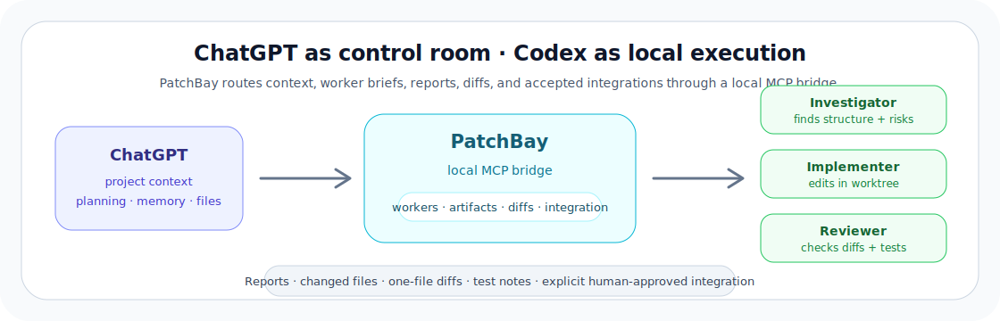
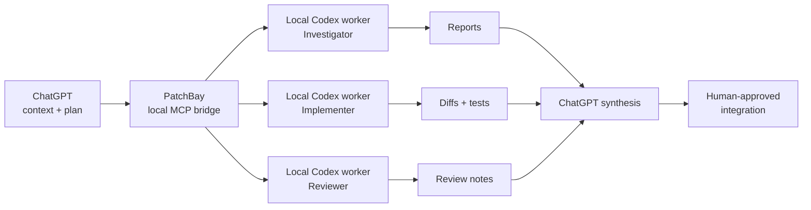

<h1 align="center">PatchBay</h1>

<p align="center">
  <strong>Coordinate local Codex CLI workers from ChatGPT.</strong>
</p>

<p align="center">
  <a href="QUICKSTART.md">Quick start</a>
  ·
  <a href="docs/user/chatgpt-instructions.md">ChatGPT usage</a>
  ·
  <a href="docs/architecture/overview.md">Architecture</a>
  ·
  <a href="SECURITY.md">Security</a>
  ·
  <a href="TESTING.md">Testing</a>
</p>

<p align="center">
  
  
  
  
  
</p>

<p align="center">
  <picture>
    <source media="(prefers-color-scheme: dark)" srcset="docs/assets/patchbay-hero-dark.svg">
    <source media="(prefers-color-scheme: light)" srcset="docs/assets/patchbay-hero-light.svg">
    
  </picture>
</p>

PatchBay is an independent local MCP bridge that lets ChatGPT coordinate user-authorized Codex CLI work in local repositories. It routes conversation context, generated files, worker briefs, reports, diffs, and follow-up instructions through a reviewable local workflow instead of making the human copy-paste between ChatGPT and terminal Codex.

Use it when the best task context already lives in ChatGPT — a long conversation, Project, uploaded file, generated artifact, planning thread, or prior decision trail — but the real work needs your local repository, git state, dependencies, tools, and configured Codex CLI.

## Why PatchBay?

Without PatchBay, the human becomes the transport layer.

You copy a brief from ChatGPT into Codex, copy files or snippets back, paste diffs into the chat, ask for a revision, copy the next instruction back into the terminal, then repeat. That workflow loses context, wastes attention, and makes multi-step agent work feel smaller than it should.

PatchBay removes that manual bridge.

| Without PatchBay | With PatchBay |
| --- | --- |
| Copy prompts from ChatGPT into terminal Codex | ChatGPT briefs local Codex workers through MCP |
| Paste reports, files, test output, and diffs back manually | Worker reports, artifacts, changed files, and diffs flow back into the chat |
| Restart context every time the task changes | Named workers can continue across turns and PatchBay restarts |
| Coordinate one-off agent calls by hand | ChatGPT can manage investigator, implementer, reviewer, and verifier workers |
| Treat local execution and high-context reasoning as separate loops | ChatGPT plans and coordinates while Codex works in the local repo |

## The 30-second workflow



1. Start PatchBay on an approved local repository.
2. Connect ChatGPT to PatchBay through the MCP connector or another MCP client.
3. Ask ChatGPT to appoint named Codex workers.
4. Workers investigate, edit, test, review, or verify in local context.
5. ChatGPT compares reports, changed files, and diffs.
6. You explicitly approve integration into the base checkout.

## What PatchBay gives you

| Benefit | What it means |
| --- | --- |
| **No copy-paste bridge** | Move briefs, generated files, worker reports, diffs, and follow-up instructions through MCP instead of manually shuttling text between apps. |
| **ChatGPT as project lead** | Use ChatGPT for high-context planning, decomposition, worker assignment, report comparison, and final synthesis. |
| **Named durable workers** | Start workers such as `Architecture Investigator`, `Backend Implementer`, `Adversarial Reviewer`, or `Verification Worker`, then continue them later by name. |
| **Truthful terminal state** | Persist exact Codex `task_complete` reports and completed worker state before bounded cleanup of the complete process group; follow-up and integration wait until cleanup finishes. |
| **Local execution stays local** | Codex still runs through your local Codex CLI against your repository, git state, dependencies, shell, and configured account. |
| **Reviewable integration** | Inspect reports, changed files, one-file diffs, and integration previews before applying accepted worker output. |
| **Artifact transfer** | Import ChatGPT-generated files or zip packages into local worker context without manual file handling. |
| **Advanced escalation loop** | Store a local blocked-problem report for ChatGPT, write the answer back into PatchBay, then explicitly dispatch it to a worker when useful. |
| **Optional machine fleet** | Implemented Hub/Edge mode lets one or more ChatGPT conversations create independent durable task groups and route each grouped worker team to one enrolled machine, with fenced result recovery across lease expiry and rolling upgrades. |

## Example: ChatGPT as manager

```text
Use PatchBay. Act as the manager of local Codex workers, not as the primary file reader.

Open this repository and appoint:
- one architecture investigator,
- one implementation worker,
- one adversarial reviewer,
- one verification worker.

Use isolated worktrees for writable work. Compare their reports, inspect diffs,
run focused checks, and integrate only explicitly accepted changes.
```

This is the intended PatchBay posture: ChatGPT coordinates the work, local Codex workers execute it, and the human remains the authority for repository integration.

## Who PatchBay is for

PatchBay is built for developers and AI-assisted builders who already use ChatGPT and Codex CLI, and who want the two systems to operate as one controlled local workflow.

It is especially useful when you:

- do serious repository work from long ChatGPT conversations;
- use ChatGPT Projects, memory, uploaded files, generated artifacts, or planning threads as source context;
- want ChatGPT to coordinate several local coding workers instead of giving one-off advice;
- need local execution against real dependencies, git state, and project tools;
- want inspectable reports, diffs, and explicit integration instead of hidden automation;
- experiment with MCP, local-agent workflows, or multi-worker software engineering loops.

## What PatchBay can coordinate

| Area | PatchBay support |
| --- | --- |
| **MCP transport** | Streamable HTTP `/mcp` and stdio for local MCP hosts |
| **ChatGPT connector use** | ChatGPT-ready descriptors, setup output, tokenized tunnel URLs, and worker-first tool mode |
| **Workspace context** | Repository tree, file reads, search, git status/diff, AGENTS, skills, context packs, and `.ai-bridge` handoffs |
| **Codex workers** | Named workers, continuation, status, reports, peer context, changed-file inspection, diffs, and stop/integrate controls |
| **Model-aware delegation** | Live Codex catalog discovery plus advisory Luna/Terra/Sol routing, specialized legacy fallbacks, and per-worker reasoning effort |
| **Isolation** | Isolated writing worktrees by default, with explicit integration back to the base checkout |
| **Artifacts** | Import ChatGPT-generated files or zip packages into worker context |
| **Repository boundary** | Allowed roots, path guard, tokenized public access, tool modes, and mutation locks |
| **Advanced loops** | Pro Escalation requests, local handoff scripts, Codex job control, review jobs, resume/interactive flows |

The full public tool surface is documented in [docs/reference/public-tool-surface.md](docs/reference/public-tool-surface.md). Additional operational details moved out of the root README are in [docs/reference/tool-surface-and-worker-details.md](docs/reference/tool-surface-and-worker-details.md).

## Quick start

> [!IMPORTANT]
> Start with a disposable repository. PatchBay gives ChatGPT a controlled route into local Codex and local files.

Requirements:

- Python 3.10+
- Git
- `codex` CLI on `PATH`
- Codex CLI login or API key configured for the local Codex CLI

From the PatchBay repository:

```bash
python3 -m venv .venv
source .venv/bin/activate
pip install -r requirements.txt
pip install -e ".[test]"
codex login
patchbay doctor
```

Start PatchBay against a local repository with the worker-first tool surface:

```bash
patchbay start --root /path/to/repo --tool-mode worker
```

For ChatGPT web, start PatchBay with an HTTPS tunnel and a private tokenized Server URL:

```bash
export PATCHBAY_HTTP_TOKEN='<long-random-token>'
patchbay start \
  --root /path/to/repo \
  --tunnel-mode cloudflare \
  --tool-mode worker \
  --save-profile \
  --reveal-token
```

Then create a ChatGPT connector using the printed HTTPS `/mcp` Server URL. Use `No Authentication / None` in ChatGPT because the copied Server URL already carries the PatchBay token.

See [QUICKSTART.md](QUICKSTART.md) for the complete disposable-repo flow and [docs/user/chatgpt-connector-setup.md](docs/user/chatgpt-connector-setup.md) for the connector-specific setup notes.

## Safety and usage boundaries

PatchBay is powerful by design. It gives ChatGPT a route into local development workflows, so the project is intentionally explicit about where authority begins and ends.

- PatchBay is an independent open-source project. It is not affiliated with, endorsed by, sponsored by, or maintained by OpenAI.
- PatchBay is a local workflow bridge, not a quota bypass layer.
- It does not bypass OpenAI rate limits, usage limits, billing, safety systems, account controls, or Codex usage accounting.
- It does not scrape ChatGPT, automate hidden ChatGPT UI extraction, reverse engineer OpenAI services, modify OpenAI clients, pool accounts, or resell access.
- ChatGPT interactions remain under the user's ChatGPT account and connector permissions.
- Codex execution remains under the user's local Codex CLI configuration, subscription, API key, or billing arrangement.
- Repositories must be owned by the user or explicitly authorized for use.
- The recommended ChatGPT-facing default is `--tool-mode worker`, which exposes worker orchestration and read-only context before broader write/bash surfaces.
- Writing workers use isolated worktrees by default, and integration is explicit: inspect reports, changed files, and diffs before applying accepted output.

> [!NOTE]
> PatchBay uses OpenAI product names only to describe compatibility with user-configured OpenAI services. It should not be presented as an official OpenAI product or partnership.

More detail: [SECURITY.md](SECURITY.md), [docs/security/product-boundary.md](docs/security/product-boundary.md), and [docs/security/usage-boundaries-openai.md](docs/security/usage-boundaries-openai.md).

## Technical highlights

| Technical area | Detail |
| --- | --- |
| **Protocol** | MCP server with Streamable HTTP and stdio transports |
| **Runtime** | Python + FastAPI |
| **Execution engine** | Local Codex CLI subprocesses |
| **Worker model** | Durable named workers with continuation, status, reports, partial notes, and evidence |
| **Coordination** | Multi-worker reports, peer context, review context, current/recent/history scopes, and compact team status |
| **Isolation** | Isolated writing worktrees by default; shared-write and read-only modes exist for deliberate cases |
| **Review model** | Changed-file inventory, paged worker-side file reads, one-file diffs, and integration preview |
| **Repository controls** | Allowed roots, path guard, token-gated public tunnels, per-repo mutation locks, and dirty-base checks |
| **Artifacts** | ChatGPT-generated files/zips can be imported into worker context without editing the repo |
| **Power modes** | `worker`, `standard`, `full`, and `minimal` tool surfaces with runtime-aware tool advertisement |
| **Optional hub/edge mode** | `patchbay hub start` plus `patchbay edge start` uses Hub V2 by default and exposes the exact 31-tool manager surface across enrolled machines, with durable work groups pinning each task to one machine and an end-to-end completion contract preventing premature manager handoff. Set `hub.control_plane: v1` only for an intentional legacy deployment; invalid values fail at startup. |

## Current status

PatchBay is **pre-release verified**, not public-release complete. It is already used internally for ChatGPT Pro to a private PatchBay VM managing local Codex workers. Occasional small bugs are still expected, and broader public/browser multi-session validation remains a release target.

Core local validation currently covers:

- Python compile checks;
- the test suite;
- live local MCP probing against a disposable repo;
- named worker continuity;
- isolated worker write/restart/continue/diff/cleanup;
- multi-worker peer report/diff relay;
- worker integration preview/apply;
- direct multi-client MCP ownership and takeover behavior.

See [TESTING.md](TESTING.md), [docs/testing/evals.md](docs/testing/evals.md), and [docs/testing/current-readiness.md](docs/testing/current-readiness.md) for the full validation matrix.

<details>
<summary>Current validation snapshot</summary>

| Area | Status |
| --- | --- |
| Codex CLI baseline | Current local verification recorded `codex-cli 0.144.1` |
| Python checks | `compileall` passes |
| Test suite | Current repair candidate: `955 passed, 4 skipped` on macOS and `958 passed, 1 skipped` in the production Linux environment (the same 959-test inventory with platform-specific skips) |
| Live local MCP probe | `scripts/live_mcp_eval.py --json` passes against a disposable repo |
| Pro Escalation request loop | Unit tests and live MCP probe cover create/list/read/claim/respond/dispatch paths |
| Named worker continuity eval | `scripts/worker_phase1_eval.py --timeout 600` passes real Codex start/restart/continue |
| Isolated writing worker eval | `scripts/worker_phase2_eval.py --timeout 900` passes real Codex isolated write/restart/continue/diff/cleanup |
| Multi-worker coordination eval | `scripts/worker_phase3_eval.py --timeout 900` passes real Codex peer diff/report relay |
| Worker integration eval | `scripts/worker_phase4_eval.py --timeout 900` passes real Codex integration preview/apply |
| Real MCP worker negative-case trial | `scripts/real_mcp_worker_trial.py --include-safety-cases` passes lifecycle and negative cases |
| Direct multi-client MCP trial | `scripts/real_mcp_worker_trial.py --multi-client --tool-mode worker` passes two-session ownership/takeover/integration checks |
| Public tunnel MCP probe | Earlier tokenized ngrok simulation passed core connector behavior; current run requires a validation hostname |
| Active ChatGPT Pro VM worker use | Working reliably in current internal use for ChatGPT Pro to private PatchBay VM workflows |
| Parallel ChatGPT browser conversations | Pending |
| Real apply-job diff eval from ChatGPT | Pending |
| Real resume/continuation eval from ChatGPT | Pending |

</details>

## Documentation map

| Need | Read |
| --- | --- |
| Full documentation index | [docs/README.md](docs/README.md) |
| First disposable run | [QUICKSTART.md](QUICKSTART.md) |
| ChatGPT tool-use pattern | [docs/user/chatgpt-instructions.md](docs/user/chatgpt-instructions.md) |
| ChatGPT connector setup | [docs/user/chatgpt-connector-setup.md](docs/user/chatgpt-connector-setup.md) |
| Worker bridge | [docs/worker-bridge/README.md](docs/worker-bridge/README.md) |
| Architecture | [docs/architecture/overview.md](docs/architecture/overview.md) |
| Tool reference | [docs/reference/public-tool-surface.md](docs/reference/public-tool-surface.md) |
| Migrated tool and worker details | [docs/reference/tool-surface-and-worker-details.md](docs/reference/tool-surface-and-worker-details.md) |
| Configuration reference | [docs/reference/configuration.md](docs/reference/configuration.md) |
| Security model | [SECURITY.md](SECURITY.md) |
| OpenAI usage boundaries | [docs/security/usage-boundaries-openai.md](docs/security/usage-boundaries-openai.md) |
| Testing | [TESTING.md](TESTING.md) |
| Current validation status | [docs/testing/current-readiness.md](docs/testing/current-readiness.md) |
| Product rationale | [docs/project/why-patchbay.md](docs/project/why-patchbay.md) |
| CodexPro attribution | [NOTICE](NOTICE) |

## Credits

PatchBay includes behavior, documentation, tests, and implementation patterns derived from or inspired by open-source CodexPro work. See [NOTICE](NOTICE) for attribution and license details.

## License

MIT
