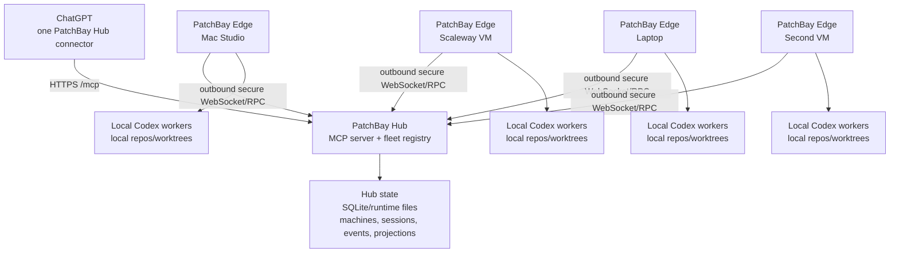

# Multi-Machine Hub Implementation Plan

Status: selected implementation direction, not yet implemented.

This document turns the multi-machine options investigation into the concrete
plan PatchBay should build next.

## Decision

Build a **central PatchBay Hub with outbound PatchBay Edge nodes**.

Do not make ChatGPT connect to four separate full PatchBay connectors as the
final product. That works as a temporary bridge, but it gives ChatGPT duplicate
tool catalogs and no single fleet state. The product Roman wants is one ChatGPT
connector that can see every online machine and route work to them.

The hub is the stable HTTPS MCP server ChatGPT connects to. Every machine runs a
normal local PatchBay runtime plus a lightweight edge client that connects
outbound to the hub. ChatGPT talks only to the hub. The hub lists machines,
shows their status, exposes their workspaces, and routes worker commands to the
selected machine.



## Why A Hub Is Necessary

If ChatGPT must automatically see all online machines from one app, there must
be one stable server that ChatGPT connects to.

Without a hub, every machine needs its own public MCP Server URL and its own
ChatGPT connector. That is usable, but not the desired experience.

With a hub:

- ChatGPT sees one tool catalog;
- each machine can be behind NAT because it connects outbound to the hub;
- offline machines simply disappear or show `offline`;
- machine identity, capabilities, workspace aliases, and worker status are
  visible in one place;
- several ChatGPT conversations can coordinate through the same hub later.

The hub does not need to be complicated at first. It should not run every worker
itself. It should route commands to edge machines and store compact state.

## Core Product Shape

### Hub

The hub is an MCP server exposed to ChatGPT. It owns:

- ChatGPT-facing tool descriptors and server instructions;
- fleet registry;
- node enrollment;
- node heartbeats;
- machine capability summaries;
- workspace projections;
- compact worker status projections;
- cross-machine report collection;
- future mailbox/campaign coordination;
- stable ChatGPT Server URL.

The hub does not own:

- local repository files;
- local Codex sessions;
- local worker worktrees;
- machine-local credentials;
- final source-of-truth worker state.

Those remain on each edge machine.

### Edge Node

Each machine runs PatchBay Edge. Edge owns:

- local PatchBay runtime;
- local Codex CLI and Codex auth;
- local allowed roots;
- local worker start/message/status/inspect/integrate;
- local path guards and power policy;
- local repository locks;
- local worktrees and logs.

Edge opens an outbound secure connection to Hub. The hub sends RPC requests over
that connection. Edge executes them locally through the existing PatchBay
service graph and returns structured results.

### ChatGPT

ChatGPT sees one connector, for example:

```text
PatchBay Hub
```

It starts every task by checking the fleet:

```text
patchbay_fleet_status
patchbay_machine_list
patchbay_machine_workspaces
```

Then it routes work:

```text
patchbay_worker_start(machine_id="roman-scaleway-ucl", ...)
patchbay_worker_start(machine_id="local-workstation", ...)
patchbay_worker_status(machine_id="all")
patchbay_worker_message(machine_id="roman-scaleway-ucl", worker="Backend Reviewer", ...)
```

## Enrollment Flow

The simplest smart enrollment model is a one-time pairing code.

### 1. Start Hub

On the hub machine, likely the Scaleway VM first:

```bash
export PATCHBAY_HOME="$HOME/.patchbay-hub"
patchbay hub init
patchbay hub start \
  --host 127.0.0.1 \
  --port 8000 \
  --public-base-url https://hub.example.com/patchbay-hub \
  --tool-mode hub \
  --reveal-token
```

The hub prints:

```text
ChatGPT Server URL:
https://hub.example.com/patchbay-hub/mcp?patchbay_token=<hub-chatgpt-token>

Create machine enrollment code:
patchbay hub enroll-code create --name "Local Workstation"
```

### 2. Create Enrollment Code

On the hub:

```bash
patchbay hub enroll-code create \
  --name "Local Workstation" \
  --tags local,documents,high-storage \
  --ttl-minutes 30
```

Output:

```text
Enrollment code: PB-EXAMPLE-CODE
Hub URL: https://hub.example.com/patchbay-hub
```

The code is short-lived and one-use.

### 3. Enroll Machine

On the machine being added:

```bash
export PATCHBAY_HOME="$HOME/.patchbay-edge"
patchbay edge enroll \
  --hub https://hub.example.com/patchbay-hub \
  --code PB-EXAMPLE-CODE \
  --machine-name "Local Workstation" \
  --machine-id local-workstation \
  --root /workspace \
  --allow-root /workspace/Documents \
  --tags local,documents,high-storage
```

The hub validates the pairing code and returns a machine token. Edge stores:

```text
machine_id
hub_url
node_token
display_name
tags
allowed roots
```

The token is not committed and is not shown to ChatGPT.

### 4. Start Edge

```bash
patchbay edge start
```

The edge connects outbound to the hub and begins heartbeats. ChatGPT now sees
the machine in `patchbay_machine_list`.

## Identity Model

Use separate identities. Do not merge these concepts.

| Identity | Owner | Purpose |
| --- | --- | --- |
| `hub_id` | Hub | Stable hub instance identity. |
| `machine_id` | Edge machine | Stable machine identity chosen at enrollment. |
| `node_token` | Hub and Edge | Authenticates one edge machine to the hub. |
| `chatgpt_token` | Hub and ChatGPT connector | Authenticates ChatGPT to the hub MCP endpoint. |
| `client_ref` | Hub | Safe hashed MCP client/session reference. |
| `chatgpt_session_ref` | Hub | Safe hashed ChatGPT conversation/session hint when available. |
| `work_run_ref` | Hub | Current task/run grouping. |
| `worker_id` | Edge | Local durable worker identity on one machine. |
| `fleet_worker_ref` | Hub | Hub reference to a worker on a specific machine. |

`machine_id` is not a secret. `node_token` and `chatgpt_token` are secrets.

## Hub State

Use SQLite under `PATCHBAY_HOME` for hub state in the first implementation.
Runtime files are acceptable for early prototypes, but SQLite will make
heartbeats, leases, and event projections easier.

Tables or equivalent stores:

- `machines`
- `machine_tokens`
- `machine_connections`
- `machine_heartbeats`
- `machine_capabilities`
- `machine_workspaces`
- `fleet_workers`
- `fleet_events`
- `mail_channels`
- `mail_messages`
- `chatgpt_sessions`
- `work_runs`

Machine records store safe projections only:

```json
{
  "machine_id": "roman-scaleway-ucl",
  "display_name": "Scaleway UCL VM",
  "status": "online",
  "tags": ["cloud", "full-access", "private-repos"],
  "capabilities": {
    "codex": true,
    "max_concurrent_workers": 10,
    "tool_mode": "worker",
    "direct_write": true,
    "bash_mode": "full"
  },
  "workspaces": [
    {
      "alias": "RetailMind",
      "repo_name": "RetailMind",
      "kind": "git",
      "branch": "main"
    }
  ]
}
```

Do not store raw Codex auth, raw `.env`, raw local logs, raw transcripts, or
full private filesystem inventories in hub state.

## Edge Connection Protocol

Use an outbound persistent connection from edge to hub.

Recommended V1 transport:

```text
WebSocket over HTTPS
```

Why:

- local laptops and home machines do not need public inbound ports;
- hub can push RPC requests to edge;
- edge can stream compact progress/events back;
- reconnect logic is straightforward.

V1 message envelope:

```json
{
  "id": "rpc_...",
  "type": "request|response|event|heartbeat|error",
  "machine_id": "roman-scaleway-ucl",
  "method": "worker.start",
  "params": {},
  "created_at": "..."
}
```

V1 methods:

- `node.hello`
- `node.heartbeat`
- `node.capabilities`
- `workspace.list`
- `workspace.open`
- `worker.options`
- `worker.start`
- `worker.message`
- `worker.status`
- `worker.inspect`
- `worker.stop`
- `worker.integrate`

The edge executes these by calling existing PatchBay runtime methods rather
than shelling out to a second HTTP server.

## ChatGPT-Facing Hub Tools

Do not expose every edge's full `codex_*` catalog to ChatGPT. Expose a smaller
fleet-native catalog.

Initial hub mode tools:

| Tool | Purpose |
| --- | --- |
| `patchbay_fleet_status` | Compact status of online/offline machines and active workers. |
| `patchbay_machine_list` | List machines, tags, capabilities, and health. |
| `patchbay_machine_workspaces` | Show workspaces on one or all machines. |
| `patchbay_worker_options` | Show model/reasoning options per machine or selected machine. |
| `patchbay_worker_start` | Start a worker on a selected machine. |
| `patchbay_worker_message` | Continue a worker on its machine. |
| `patchbay_worker_status` | Show worker/team status across one machine or fleet. |
| `patchbay_worker_wait` | Patient status wait across one machine or fleet. |
| `patchbay_worker_inspect` | Inspect report/status/diff/file for a worker on its machine. |
| `patchbay_worker_stop` | Stop a worker on its machine, with existing confirmation rules. |
| `patchbay_worker_integrate` | Apply an accepted worker result on that worker's machine. |

Later hub tools:

| Tool | Purpose |
| --- | --- |
| `patchbay_mail_send` | Send a message to a ChatGPT conversation, machine, worker, or channel. |
| `patchbay_mail_list` | List channel messages compactly. |
| `patchbay_mail_read` | Read one message. |
| `patchbay_mail_reply` | Reply in a channel/thread. |
| `patchbay_campaign_create` | Create a multi-machine work campaign. |
| `patchbay_campaign_status` | Show campaign state across ChatGPT sessions and machines. |

## ChatGPT Instructions

The hub's `initialize.instructions` must say:

- ChatGPT is a fleet manager of PatchBay machines and Codex workers.
- Start with `patchbay_fleet_status`.
- If the user names a machine, route there.
- If the user names a repo/project, find which machines advertise it.
- Use several machines when the task benefits from parallelism.
- Workers are machine-local employees; do not assume a worker can move to
  another machine.
- Use `machine_id` explicitly when starting, messaging, inspecting, stopping, or
  integrating a worker.
- For cross-machine work, collect reports and send bounded report context to a
  synthesis worker.
- Do not use manual direct reads as the default when workers can investigate.
- Do not retry an offline machine blindly; choose another machine or report that
  it is offline.

## Machine Selection Rules

ChatGPT should select machines by capability and workspace, not by path guessing.

Examples:

- Documents canonical work: prefer the machine tagged `documents-canonical`.
- Cloud-safe long work: prefer Scaleway VM or always-on cloud workbench.
- Heavy storage work: prefer machine tagged `high-storage`.
- Local-only files: use the machine that advertises the workspace.
- Parallel investigation: start read-only workers on several machines.
- Final integration: choose one integration machine and route final apply there.

This is guidance for ChatGPT, not deterministic routing code. The model should
use these facts intelligently.

## Cross-Machine Worker Context

V1 cross-machine synthesis should be report-based.

Flow:

1. Start workers on multiple machines.
2. Wait for reports.
3. Hub collects compact reports.
4. Start a synthesis worker on one selected machine.
5. Hub injects the other workers' reports as context.

Do not copy raw worktrees between machines in V1. Use reports, artifacts,
patches, and Git branches.

## Cross-Machine Writes

Keep all writes machine-local until explicitly integrated.

Rules:

- a worker writes only in its own machine's local isolated worktree;
- `patchbay_worker_integrate` applies on the same machine where the worker ran;
- cross-machine conflicts are resolved by a dedicated integration worker;
- for the same GitHub repository across machines, the durable coordination layer
  is branch/commit/push/pull, not a fake distributed local lock;
- hub status should say which machine owns each unintegrated worker result.

## Multi-ChatGPT Coordination

Once the hub exists, several ChatGPT conversations connected to the same hub can
share:

- machine status;
- fleet worker status;
- campaign events;
- mailbox messages;
- report references.

Do not implement this by showing every historical worker to every conversation.
Use channels and campaigns.

V1 campaign model:

```text
campaign_id
title
owner_chatgpt_session_ref
machines
workers
messages
events
status
```

Default ChatGPT views should show current campaign/work run plus live/problem
workers, not the entire fleet history.

## Security Model

The hub is a powerful control point. Keep authority separated:

- ChatGPT authenticates to the hub with a hub token or later OAuth.
- Each edge authenticates to hub with its own node token.
- A node token controls one machine only.
- A leaked node token should not control the hub or other machines.
- The hub never receives local Codex auth files.
- The hub never executes local shell commands itself unless it is also running
  as an edge node.
- Edge nodes enforce local allowed roots and power policy even if the hub asks.
- Hub stores compact projections and event logs, not raw local secrets.

For Roman's private workbench, full machine power is allowed after enrollment.
For open-source users, defaults should stay narrow and explicit.

## Why This Is Not Too Complex

The hub can be simple if the first implementation has strict boundaries:

- Hub is registry plus router.
- Edge remains the executor.
- Worker state remains local on Edge.
- Hub stores projections, not full local reality.
- Cross-machine context is reports first.
- Cross-machine writes use Git/patches, not distributed filesystem tricks.

The complex version would be a full distributed scheduler, shared filesystem,
global worker database, distributed lock service, and automatic merge system.
That is not the V1.

## Implementation Phases

### Phase 0: Machine Identity In Current PatchBay

Add config:

```yaml
machine:
  id:
  display_name:
  tags: []
  role:
```

Expose safe machine metadata in:

- `codex_self_test`
- `codex_inventory`
- launcher setup guide

Add tests that machine metadata does not expose tokens or runtime paths.

### Phase 1: Hub Runtime Skeleton

Add:

- `patchbay hub init`
- `patchbay hub start`
- hub config section;
- hub SQLite/runtime store;
- hub MCP mode `hub`;
- hub self-test;
- hub setup guide.

No edge routing yet.

### Phase 2: Edge Enrollment

Add:

- `patchbay hub enroll-code create`;
- one-time pairing code store;
- `patchbay edge enroll`;
- edge profile storage;
- node token generation;
- token rotation command;
- enrollment tests.

### Phase 3: Edge Connection And Heartbeat

Add:

- outbound WebSocket client in edge;
- hub WebSocket endpoint;
- `node.hello`;
- `node.heartbeat`;
- capability and workspace projection;
- offline detection.

ChatGPT can now see machines online/offline.

### Phase 4: Fleet Read-Only Tools

Expose:

- `patchbay_fleet_status`;
- `patchbay_machine_list`;
- `patchbay_machine_workspaces`;
- `patchbay_worker_options`.

This is the first ChatGPT-visible hub release.

### Phase 5: Routed Worker Start/Status/Inspect

Add routing for:

- `patchbay_worker_start`;
- `patchbay_worker_status`;
- `patchbay_worker_wait`;
- `patchbay_worker_inspect`;
- `patchbay_worker_stop`.

These wrap current edge worker runtime and return compact hub-normalized
results.

### Phase 6: Routed Worker Message And Cross-Machine Context

Add:

- `patchbay_worker_message`;
- report collection from one machine;
- report injection into another machine's worker brief;
- bounded cross-machine `context_from_fleet_workers`.

### Phase 7: Routed Integration

Add:

- `patchbay_worker_integrate`;
- machine-local integration preview;
- explicit machine id in every integration result;
- Git branch/push/pull guidance for cross-machine work.

### Phase 8: Mailbox And Campaigns

Add:

- campaign ids;
- channels;
- messages;
- read cursors;
- claims;
- replies;
- event projections.

This enables multi-ChatGPT coordination without historical-status clutter.

## First Real Roman Deployment

Use the Scaleway VM as the first hub because it is always on and already has a
stable public URL.

Install/update PatchBay on:

- Scaleway VM as Hub + Edge;
- local Mac as Edge;
- second local computer as Edge;
- second VM/laptop as Edge.

ChatGPT connector:

```text
Name: PatchBay Hub
Server URL: https://hub.example.com/patchbay-hub/mcp?patchbay_token=<hub-chatgpt-token>
Authentication: None, because the copied URL carries the private token
```

Expected ChatGPT start:

```text
Use PatchBay Hub. First call patchbay_fleet_status, then choose machines based
on online status, workspace availability, and task needs. Use multiple workers
across machines when useful.
```

## Verification Plan

Automated:

- hub store unit tests;
- enrollment code lifecycle tests;
- edge token auth tests;
- heartbeat/offline tests;
- hub tool descriptor tests;
- routed worker start/status/inspect tests with fake edge;
- end-to-end local hub plus two fake edges;
- no-token/no-wrong-token tests;
- redaction tests.

Live:

1. Start local hub.
2. Enroll two local fake edges.
3. Connect MCP client to hub.
4. Verify `patchbay_fleet_status`.
5. Start one worker on each edge.
6. Wait for status.
7. Inspect both reports.
8. Start synthesis worker with both reports as context.
9. Stop one edge and verify it becomes offline.
10. Restart edge and verify it reconnects with the same machine id.

Real:

1. Deploy hub on Scaleway.
2. Enroll Scaleway as self-edge.
3. Enroll one local Mac.
4. Create ChatGPT connector.
5. Ask ChatGPT to start one worker on VM and one on Mac.
6. Verify reports and machine status.

## Open Decisions

- Whether hub and edge should live in one process with modes, or separate
  commands/processes. Initial answer: same package, separate commands.
- Whether edge RPC should call internal Python services directly or call the
  local MCP protocol. Initial answer: direct service calls for performance and
  fewer protocol layers.
- Whether to expose low-level direct file tools through hub. Initial answer:
  no for V1; expose worker-first fleet tools.
- Whether to support OAuth immediately. Initial answer: no for Roman/self-hosted
  V1; pairing codes and tokens first, OAuth later for public multi-user.
- Whether to use SQLite or filesystem JSONL. Initial answer: SQLite for hub,
  existing runtime files for edge-local worker state.

## Final Architecture Summary

The selected architecture is:

```text
One ChatGPT connector
→ one PatchBay Hub
→ many outbound PatchBay Edge nodes
→ each Edge runs local Codex workers
→ Hub routes, observes, and coordinates
→ Edge executes and enforces local authority
```

This gives Roman the experience he wants: turn on several machines, start
PatchBay Edge on each, open ChatGPT, and see the online fleet from one app.

