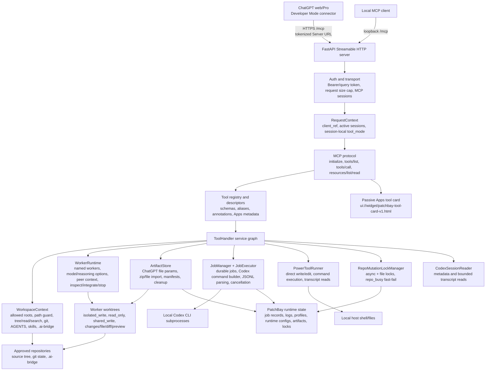

# Hybrid Architecture

## Product Identity

`patchbay` is the release repository for PatchBay: a local MCP control plane that routes ChatGPT context into local Codex execution.

The product is powerful because it lets ChatGPT web/Pro, Projects, memory, and active conversations drive local Codex workers without turning the human into a copy-paste bridge. ChatGPT keeps the high-level conversation, product context, generated files, and coordination loop. Local Codex keeps the repository, git state, toolchain, credentials, and execution environment.

The intended user experience is:

1. Start one local application.
2. Connect ChatGPT web/Pro through Developer Mode or an Apps-compatible MCP connector.
3. Open an allowed local workspace.
4. Load repository context, AGENTS instructions, selected files, skills, git status, and diffs.
5. Import ChatGPT-generated files or zips as local worker context when needed.
6. Delegate investigations or isolated implementation work to named Codex workers and continue them by human name after restart.
7. Pass reports, changed-file context, and diffs between workers.
8. Inspect job status, results, changed files, diffs, and integration previews from ChatGPT.
9. Apply accepted worker output without automatic commits.
10. Optionally enable direct workspace tools such as edit, bash, or session transcript reads behind explicit power-mode controls.

The product is not trying to preserve either current architecture for its own sake. PatchBay repository remains the final application because that is the desired release target.

## Runtime Decision

The recommended architecture is Python/FastAPI first, with useful connector and workspace ideas ported into PatchBay rather than run as a permanent TypeScript sidecar.

Reasons:

- PatchBay already owns the most valuable execution boundary: async Codex jobs, isolated apply worktrees, result inspection, diff APIs, and environment restriction.
- CodexPro's most useful systems are mostly product and connector systems: setup flow, ChatGPT metadata, workspace context, path guarding, `.ai-bridge`, auth/tunnel handling, and optional UI resources.
- A permanent Node sidecar doubles process supervision, logging policy, package management, auth review, and failure modes.
- Porting CodexPro's concepts into PatchBay gives one public MCP server and one policy layer.

A temporary Node sidecar is acceptable only for a fast ChatGPT Apps widget prototype if Python MCP resource support becomes the blocker.

## Component Model

The important boundary is not one monolithic "wrapper." PatchBay is a set of cooperating runtime services behind one MCP endpoint:

- transport/auth/session handling in `patchbay.server`;
- public protocol and ChatGPT-visible tool descriptors in `patchbay.protocol`;
- workspace orientation and `.ai-bridge` context in `patchbay.workspace`;
- durable jobs and Codex subprocess execution in `patchbay.jobs`;
- named worker orchestration in `patchbay.workers`;
- ChatGPT file/zip import in `patchbay.artifacts`;
- direct power tools in `patchbay.tools`;
- runtime profiles, status files, artifacts, and locks under `PATCHBAY_HOME` or `~/.patchbay`.

## Public MCP Boundary

The public boundary must remain explicit. Tools are registered from a typed registry, not discovered from handler functions.

Each public tool needs:

- stable name;
- "Use this when..." description optimized for ChatGPT;
- JSON input schema;
- output shape or documented structured content;
- `annotations.readOnlyHint`;
- `annotations.destructiveHint`;
- `annotations.openWorldHint`;
- `_meta.securitySchemes` mirrored for ChatGPT compatibility;
- short invocation labels;
- output template URI for the shared ChatGPT tool card resource.

Developer Mode treats tools without `readOnlyHint` as write actions, so missing annotations are product bugs.

## Tool Tiers

### Tier 1: Core Codex Jobs

Low-level tools for explicit job/session control:

- `codex_plan_job`
- `codex_apply_job`
- `codex_get_status`
- `codex_get_result`
- `codex_get_diff`
- `codex_review`
- `codex_list_sessions`
- `codex_resume`
- `codex_interactive`
- `codex_interactive_reply`
- `codex_get_config`

These remain available for compatibility and power-user control. The normal ChatGPT-first path should prefer the worker facade when the user wants durable named local Codex colleagues. Current Codex CLI `0.142.2` JSONL results are parsed from `item.completed` / `agent_message` events into structured job output.

`codex_resume`, `codex_interactive`, and `codex_interactive_reply` are async job starters classified as mutating/open-world in the public descriptors because they can continue sessions that write locally or call Codex externally. `codex_plan_job` remains locally read-only, but is not idempotent because it creates job state and can invoke Codex.

`codex_list_sessions` is metadata-only: it returns bounded known session ids from durable job records and explicitly does not read transcript bodies or return repo paths.

`codex_read_session` is the explicit transcript power mode. It is advertised as read-only but remains disabled by default; when enabled it reads only bounded Codex session JSONL messages, redacts likely secrets, and does not return local session source paths.

### Tier 2: Worker-First Delegation

Preferred tools for ChatGPT-driven Codex work:

- `codex_worker_options`
- `codex_worker_inbox`
- `codex_worker_start`
- `codex_worker_message`
- `codex_worker_list`
- `codex_worker_inspect`
- `codex_worker_integrate`
- `codex_worker_stop`

These let ChatGPT use its current conversation/project context to brief named local Codex workers, attach generated files or zips, pass reports between workers, inspect diffs, and apply accepted results without asking the user to manage backend job ids, session ids, branch names, or worktree paths.

### Tier 3: Workspace Context

Read-only tools ported from CodexPro concepts:

- `codex_open_workspace`
- `codex_repo_tree`
- `codex_search_repo`
- `codex_read_file`
- `codex_load_context`
- `codex_export_context`
- `codex_list_skills`
- `codex_load_skill`

These make ChatGPT useful before it starts a Codex job. They are bounded, redacted, and rooted in the active workspace.

### Tier 4: Handoff Artifacts

Controlled write tools limited to `.ai-bridge`:

- `codex_write_handoff`
- `codex_get_handoff_status`
- `codex_get_handoff_diff`

These bridge ChatGPT planning to local terminal execution without giving ChatGPT arbitrary write access to source files.

### Tier 5: Power Tools

Designed as first-class optional capabilities controlled by runtime configuration:

- direct file write/edit;
- safe bash;
- full bash;
- Codex session metadata;
- Codex session transcript reads;
- public tunnel mode, implemented as optional launcher-supervised child processes with token-gated HTTP.

Power tools are not "unsafe illusions"; they are product power. They must be controlled because broken control makes the tool less useful for real work.

## Worker Facade

The current product includes a natural-language worker facade over the existing runtime. It is documented in [../worker-bridge/PHASE1_DURABLE_WORKERS.md](../worker-bridge/PHASE1_DURABLE_WORKERS.md), [../worker-bridge/PHASE2_WRITING_WORKERS.md](../worker-bridge/PHASE2_WRITING_WORKERS.md), [../worker-bridge/PHASE3_MULTI_WORKER_COORDINATION.md](../worker-bridge/PHASE3_MULTI_WORKER_COORDINATION.md), and [../worker-bridge/PHASE4_INTEGRATION.md](../worker-bridge/PHASE4_INTEGRATION.md).

The worker facade lets ChatGPT manage named local Codex workers through natural-language briefs and concise reports while PatchBay keeps exact runtime mechanics internal. A worker is derived from private metadata on durable job records, plus the Codex session reference already captured by the job runtime.

The worker facade provides:

- `codex_worker_inbox`;
- `codex_worker_start`;
- `codex_worker_message`;
- `codex_worker_list`;
- `codex_worker_inspect`;
- `codex_worker_integrate`;
- `codex_worker_stop`.

The artifact inbox lets ChatGPT import generated files or zips into PatchBay runtime storage, then attach artifact ids to isolated workers through `context_from_artifacts`. Imported artifacts are copied into `.ai-bridge/imported-artifacts/` inside the worker worktree as source material and excluded from changed-file reporting, diffs, integration preview, and apply.

Default `isolated_write` workers use durable external worktrees, same-session/same-worktree continuation after PatchBay restart, on-demand changed-file inspection, one-file worker diffs, and explicit isolated workspace cleanup. Worker start/message calls can include bounded peer-worker report/change/diff context, and worker list returns a compact `team_report`. Worker integration is preview-first: ChatGPT can inspect whether the worker patch applies, then explicitly apply the accepted result into the base checkout without committing. Current lifecycle handling reconciles stale durable `running` jobs that no longer have a tracked Codex subprocess into a redacted failed report before public worker/status views.

For shared MCP Server URLs, the runtime treats ownership as coordination rather than authentication. Tool mode is session-local, worker/artifact views include session-relative ownership flags, cross-owner mutation requires explicit `takeover: true`, and base-checkout mutation paths use per-repository locks that fail fast with `repo_busy`. No separate worker database, queue, mailbox, transcript copy, role system, automatic reviewer chain, automatic commit, or automatic merge/promotion flow exists. Future work can add optional app-server backend evaluation.

The worker bridge does not replace the security boundary. It should reuse the same typed registry, path guard, power-mode controls, auth policy, artifact caps, and redaction rules used by the current public surface.

## Codex Execution Boundary

The execution boundary is organized around explicit services:

- `JobExecutor`: builds `codex exec` and resume commands with prompts sent through stdin, tracks subprocesses, cancellation, timeouts, JSONL parsing, diffs, and redacted artifacts.
- `JobManager`: durable job records, active-job admission, apply-job worktrees, worker worktree creation/removal, and persisted state.
- `WorkerRuntime`: job-derived worker identity, worker continuation, peer-worker context, artifact materialization, worktree inspection, integration preview, and accepted-result application.
- `ArtifactStore`: runtime-only ChatGPT file/zip imports, manifests, bounded inspection, workspace scoping, and materialization into isolated workers.
- `RepoMutationLockManager`: per-repository async and file locks for base-checkout writes, direct command/write paths, shared-write workers, and integration.
- `WorkspaceContext`: repository orientation, path validation, AGENTS and skills, git state, `.ai-bridge`, and direct write/edit helpers.
- `PowerToolRunner`: configured direct command execution with timeout/output controls and optional session gating.

Generic `read`, `write`, `edit`, or `bash` handlers must enter this boundary only through the tool tier policy and current tool mode. Aliases are selection aids; they do not create separate execution paths.

## Workspace Context Layer

PatchBay's workspace layer provides:

- active workspace selection from configured allowed roots;
- path guard with realpath checks and symlink escape rejection;
- blocked glob defaults for `.env`, private keys, `.git`, dependency/build output, cache folders, and configured secret paths;
- bounded tree listing;
- bounded file reads with binary and size detection;
- ripgrep-first search with safe fallback;
- git status, diff, and recent log summaries;
- AGENTS chain loading from repo root to target path;
- skill inventory and bounded `SKILL.md` loading by skill name;
- selected-file context bundle export.

The context layer is read-only except for `.ai-bridge` artifact writes and direct write/edit calls when the configured power mode exposes them.

## State And Artifacts

State should be separated by purpose:

- config: committed defaults and local overrides;
- profiles: user/workspace startup preferences and connection mode;
- job store: durable job records and process metadata;
- artifacts: bounded job outputs, diffs, and summaries;
- `.ai-bridge`: handoff and context artifacts inside the active repo;
- audit log: metadata-only events with correlation IDs.

Raw prompts, secrets, auth files, full Codex outputs, and local session transcripts must not be logged by default.

## Lineage And Attribution

CodexPro is MIT-licensed source material and product inspiration, not an upstream target, fork base, or contribution destination. PatchBay ports or rewrites useful ideas into one local MCP server and one policy layer. See [../../NOTICE](../../NOTICE) for attribution.

## Current Verification

Verified:

- local Streamable HTTP MCP startup and probing against disposable repos;
- real Codex CLI `0.142.2` `codex_plan_job` through MCP;
- current Codex JSONL structured result parsing;
- token-gated auth and tunnel fail-closed behavior in automated tests;
- direct tokenized public-tunnel MCP health, `initialize`, worker-mode `tools/list`, artifact inbox transfer, isolated worker artifact read, integration exclusion, and cleanup through ngrok;
- direct two-client MCP trial for session-local tool modes, shared worker inspection, cross-owner mutation refusal, explicit takeover, ownership transfer, and accepted-result integration;
- workspace path guards, blocked globs, symlink escape rejection, and default power-tool denial.

Not yet verified for release:

- real ChatGPT Developer Mode connection and natural tool selection;
- real ChatGPT-originated worker flows through a public tunnel from the actual UI;
- real ChatGPT-originated apply-job diff review;
- real ChatGPT-originated resume/interactive continuation.

## Remaining Architecture Work

The current hybrid implementation has the core ChatGPT-facing connector, workspace context, skill discovery/loading, `.ai-bridge` handoff, durable Codex jobs, resume/interactive job starters, public tool metadata, token-gated tunnel startup, and reusable live MCP evals in place.

Remaining work is additive:

- complete the real ChatGPT UI release evals, including ChatGPT-originated token-gated tunnel paths when advertised;
- richer auth modes beyond tokenized local/tunnel use if this becomes multi-user;
- deeper schema coverage for future tools as they are added;
- richer interactive ChatGPT card actions beyond the passive result card;
- broader Codex CLI compatibility probes across installed versions;
- CORS policy only if a trusted standalone local UI is added.

## Sources Checked

- CodexPro source at upstream commit `03556103b3dc6de2e67e6e64835a72363c3a71a1`.
- CodexPro npm version `0.28.5`.
- PatchBay source files under `src/patchbay/`, including `server.py`,
  `protocol/mcp.py`, `tools/handler.py`, `jobs/manager.py`,
  `jobs/executor.py`, `security.py`, plus `config.yaml` and `tests/`.
- OpenAI Developer Mode docs: https://developers.openai.com/api/docs/guides/developer-mode
- OpenAI Apps SDK reference: https://developers.openai.com/apps-sdk/reference
- OpenAI Apps SDK auth docs: https://developers.openai.com/apps-sdk/build/auth
- OpenAI Apps SDK security/privacy docs: https://developers.openai.com/apps-sdk/guides/security-privacy

## Phase 4 Worker Integration

Phase 4 adds explicit integration preview and accepted-result application for isolated writing workers. `codex_worker_inspect(view="integration_preview")` is read-only and reports whether a worker patch can apply to the base checkout. `codex_worker_integrate` is the explicit mutating act that applies the accepted worker result without committing and without deleting the worker worktree.
